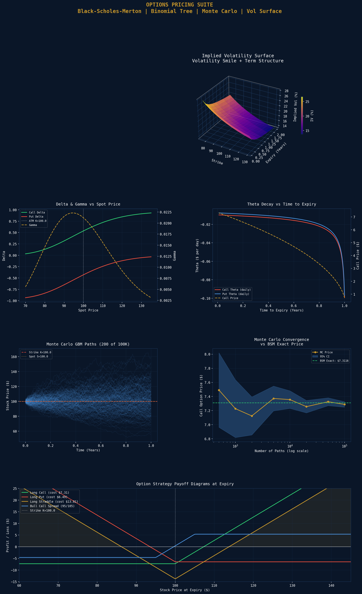

# Options Pricing Suite: Black-Scholes, Binomial Tree & Monte Carlo

A comprehensive options analytics toolkit implementing three pricing methodologies, full Greeks calculation, implied volatility extraction, and an interactive volatility surface — calibrated using the RBA cash rate as the risk-free rate.

## Market Parameters
| Parameter | Value |
|---|---|
| Spot Price | $100.00 |
| Strike | $100.00 (ATM) |
| Risk-Free Rate | 4.35% (RBA cash rate) |
| Dividend Yield | 3.50% (ASX 200 approx) |
| Volatility | 18.0% |
| Time to Expiry | 1.0 year |

## BSM Analytical Prices
| Contract | Price |
|---|---|
| ATM Call | $7.3116 |
| ATM Put | $6.4943 |
| Put-Call Parity | Verified |

## Full Greeks (ATM Call)
| Greek | Value | Interpretation |
|---|---|---|
| Delta | 0.5355 | Price change per $1 spot move |
| Gamma | 0.0212 | Delta change per $1 spot move |
| Theta | -0.0098 | Value decay per calendar day |
| Vega | 0.3816 | Value change per 1% vol move |
| Rho | 0.4624 | Value change per 1% rate move |
| Vanna | 0.0907 | Delta change per 1% vol move |
| Volga | -1.2445 | Vega change per 1% vol move |

## Monte Carlo Results (100,000 Paths)
| Method | Call Price | Put Price |
|---|---|---|
| BSM Analytical | $7.3116 | $6.4943 |
| Monte Carlo (antithetic) | $7.2780 +/- $0.0200 | $6.4918 +/- $0.0134 |
| Asian Call (arithmetic avg) | $4.1459 | N/A |
| BSM vs MC Error | $0.033592 | - |

## Binomial Tree (N=200 Steps)
| Contract | Price |
|---|---|
| European Put | $6.4857 |
| American Put | $6.6159 |
| Early Exercise Premium | $0.1302 |

## Implied Volatility Surface
| Tenor | ATM IV |
|---|---|
| 1 Month | 23.0% |
| 6 Months | 19.4% |
| 1 Year | 18.0% |
| 25-Delta Skew | 3.0% |

## Key Findings
- **Monte Carlo accuracy:** 100,000 paths with antithetic variates produces a BSM error of only $0.034 - demonstrating the effectiveness of variance reduction techniques
- **Early exercise premium:** The American put is worth $0.13 more than the European put due to the value of early exercise - significant given the 4.35% RBA cash rate and 3.50% dividend yield
- **Vol term structure:** Short-dated options (1M: 23.0%) trade at a vol premium over longer-dated options (1Y: 18.0%), consistent with near-term uncertainty being priced more richly
- **25-Delta skew of 3.0%** confirms the standard equity put skew - OTM puts are more expensive than OTM calls, reflecting demand for downside protection

## Visualisations

## Tools & Libraries
- Python 3
- numpy / scipy
- matplotlib (including 3D surface)
- yfinance
- pandas

## Files
- `Project_7_Options_Pricing_Suite.ipynb` - Full Colab notebook
- `asx_options_pricing.png` - Options analytics dashboard

## Key Concepts Demonstrated
- Black-Scholes-Merton analytical pricing
- First and second order Greeks (Delta, Gamma, Theta, Vega, Rho, Vanna, Volga)
- Put-call parity verification
- Cox-Ross-Rubinstein binomial tree with American early exercise
- Monte Carlo GBM simulation with antithetic variates
- Asian option pricing via Monte Carlo
- Newton-Raphson implied volatility solver
- Volatility smile and term structure construction
- Option strategy payoff diagrams (long call, long put, straddle, bull spread)

## Relevance to Australian Finance Industry
Optiver (Sydney office, one of the world's largest market makers) uses proprietary variants of these models for real-time options market making on ASX derivatives. Macquarie's Commodities and Global Markets team prices exotic options daily. IMC Trading uses similar analytics in systematic options strategies. This project demonstrates the full options analytics stack required for any derivatives role in Australia.
